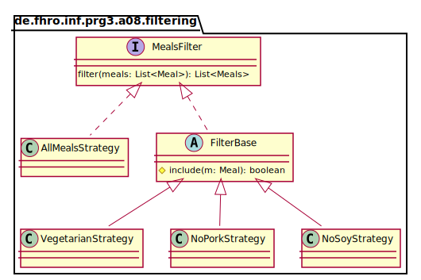

_This is an assignment to the class [Programmieren 3](https://hsro-inf-prg3.github.io) at the [University of Applied Sciences Rosenheim](http://www.fh-rosenheim.de)._

# Assignment 8: Singleton-, factory- and strategy pattern

In this assignment, we will refactor and extend the app we started to implement in the last assignment.

## Setup

1. Create a fork of this repository (button in the right upper corner)
2. Clone the project (get the link by clicking the green _Clone or download button_)
3. Import the project to your Android Studio; it behaves almost the same as IntelliJ.

## Singleton Pattern

As already explained in the lecture a singleton is an object which is accessable in your whole application at any time.
To avoid having to create a new instance of the API proxy again and again we want to implement a singleton that holds an instance of the `OpenMensaAPI` interface we implemented last time.

The following UML shows **one possibility** how this may be accomplished:


Afterwards you can use the singleton like this:

```java
OpenMensaAPIService svc = OpenMensaAPIService.getInstance();
OpenMensaAPI apiInstance = svc.getApi();

apiInstance.getMeals(...)...
```

_Remark: IntelliJ is capable to generate singletons for you. Check the "Kind" dropdown in the class creation dialog_

## Strategy and Factory Pattern - Filters

Until now we were only able to filter for vegetarian food.
This time we want to extend the filter capabilities of our app.
The following wireframe shows the new layout of our app:


The dropdown shown in wireframe is called a `Spinner` in Android.
[Spinners](https://developer.android.com/guide/topics/ui/controls/spinner.html) are a common design element if there are only a few choices the user can make.

Android Spinners have to different modes:

* dialog
* dropdown

_Remark: a dialog is a view element that lies over all other elements and prohibits all interaction with the underlying view elements until the dialog is closed._

You can set the mode in the XML element like this:

```xml
<!-- dialog -->
<Spinner
    android:id="@+id/dialogSpinner"
    android:spinnerMode="dialog"
    ... />

<!-- dropdown -->
<Spinner
    android:id="@+id/dropdownSpinner"
    android:spinnerMode="dropdown"
    ... />
```

Additionally to the vegetarian filter we already implemented in the last assignment we want to introduce the following filtering choices:

* All - no elements are filtered (the default)
* No pork - show all meals except those containing pork
* No soy - show all meals except those containing soy

To implement the filter mechanism we could just extend the existing logic by adding some more `if-else` statements but this approach isn't very flexible and results in a huge code statement which isn't readable any more.

The strategy pattern is always a good choice if you have different implementations giving you the same **kind** of result (e.g. all implementations return a list of meals).
So we decided to implement the filtering as different strategies.

The following UML is meant as an implementation advise.
You don't have to implement it this way but it might result in less code (and save you time).



_Hints: To avoid duplicate code (DRY - don't repeat yourself) you can extract the code to iterate over the list of meals and collect matching meals to an `abstract` base class `FilterBase` where you pass every meal to an `protected abstract` method which decides if the meals should be included or not. The `AllMealsStrategy` is handled otherwise because this strategoy does not have to filter anything._

The remaining problem is how to get an instance of the currently required strategy.
This is where the factory pattern comes into play.

A factory ensures that a suitable implementation is returned.
There are different options to control which implementation is returned by the factory (e.g. enums, string keys, dumb integers).
As the Android spinner gives you the position of the element which is currently selected and the 